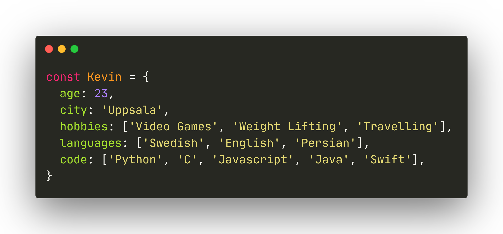

### Hi, I'm Kevin 👨🏻‍💻

I’m a 5th year student at the Computer Science programme at Uppsala University with a genuine interest in technology and mathematics. 

 

- 🌱 I'm currently learning more about dynamic web development and game programming.

<!--
**Keffin/Keffin** is a ✨ _special_ ✨ repository because its `README.md` (this file) appears on your GitHub profile.

Here are some ideas to get you started:

- 🔭 I’m currently working on ...
- 🌱 I’m currently learning ...
- 👯 I’m looking to collaborate on ...
- 🤔 I’m looking for help with ...
- 💬 Ask me about ...
- 📫 How to reach me: ...
- 😄 Pronouns: ...
- ⚡ Fun fact: ...
-->
